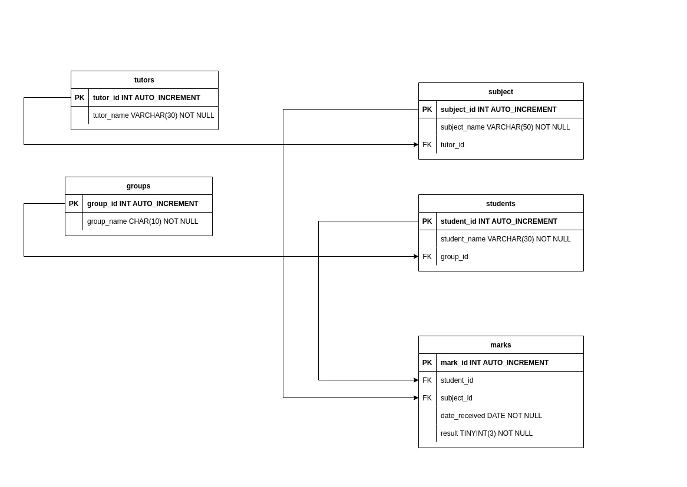

<h3>In this homework following db scheme was implemented:</h3>

<h4>You are able to receive following samples:</h4>
<ol>
    <li>5 students with the highest average result</li>
    <li>1 student with the highest average result for desired subject</li>
    <li>Average result in one group for a subject</li>
    <li>Average course result</li>
    <li>What subjects are teaching by tutor</li>
    <li>List of students in some group</li>
    <li>All student marks for subject in a group</li>
    <li>Student marks received on the last lesson</li>
    <li>List of courses which are attending by student</li>
    <li>List of courses which tutor is teaching to student</li>
    <li>Average marks for one student put by one tutor</li>
    <li>Average marks by one tutor</li>
</ol>

<h4>Data for db is generating randomly, but there are some constant values:</h4>
<ul>
    <li>Groups are always 3.</li>
    <li>Groups are always PyDev-1, PyDev-2, PyDev-3</li>
    <li>Subjects are always 6</li>
    <li>Subjects are always Django, DRF, FastAPI, Flask, NumPy, pandas</li>
    <li>Tutors are always 3, but their names are generating randomly</li>
</ul>