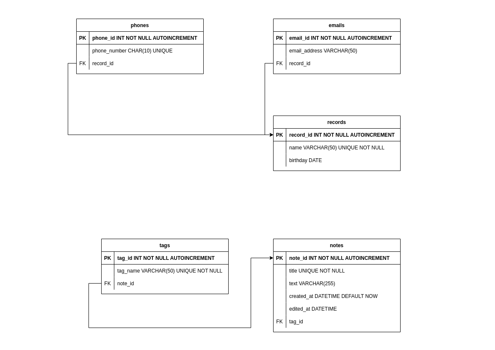

<h3>This is CLI helper with db as data storage. DB schema is following:</h3>

<h4>You are able to operate with phonebook commands:</h4>
<ol>
    <li>add [birthday, email, phone] [username] [birthday, data] to add new data to existing contact.</li>
    <li>birthdays in [days] to find users who have birthday in given gap. Days is not obligatory</li>
    <li>delete [birthday, email, phone] [username] [data] to delete desired data. In case of birthday it is not necessary to enter data</li>
    <li>delete contact [username] to delete record from your phonebook</li>
    <li>edit birthday [username] [new_date] to change birthday date</li>
    <li>find phonebook [any data] to search in your contacts</li>
    <li>new contact [username] [any data]. Data must be separated by spaces. Data is not necessary and can be phone(s), email(s) and birthday.</li>
    <li>show contact [username] to show contact data</li>
    <li>show contacts to show your phonebook contacts.</li>
    <li>List of courses which tutor is teaching to student</li>
    <li>Average marks for one student put by one tutor</li>
    <li>Average marks by one tutor</li>
</ol>
<h4>And you are able to operate with notebook commands:</h4>
<ol>
    <li>new note [title] to start adding note.</li>
    <li>edit note [title] to start editing note</li>
    <li>find note [query] to start search in your notebook</li>
    <li>show note [title] to exact note.</li>
    <li>show notes to show all titles</li>
</ol>
